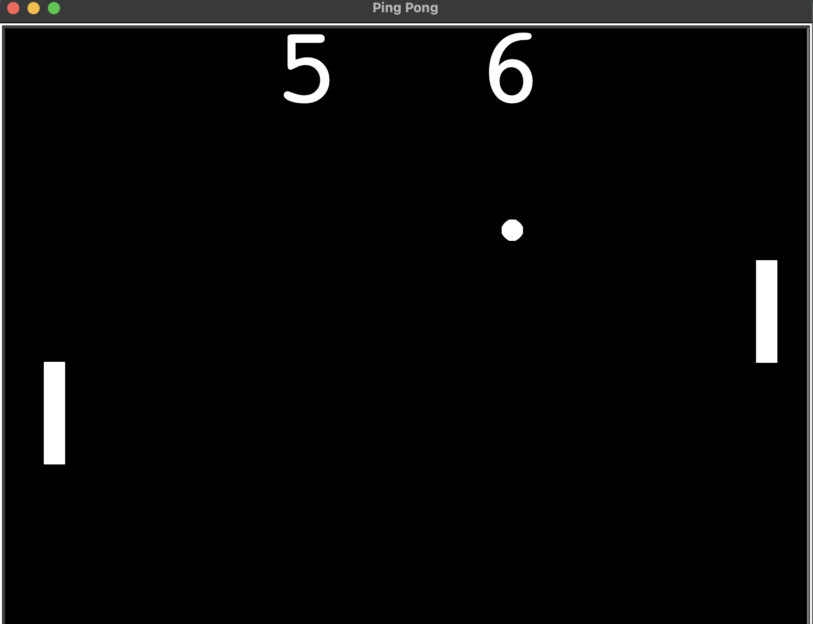

# Ping Pong Game (Turtle Graphics)

A simple two-player Ping Pong (Pong) game simulation built with Python's turtle graphics library. Control the paddles, bounce the ball, and keep score!

## Features
- Two paddles (left and right) controlled by keyboard
- Ball bounces off walls and paddles
- Scoreboard tracks points for both players
- Ball speed increases after each paddle hit
- Clean, modular code using OOP (Paddle, Ball, Scoreboard classes)

## Controls
- **Right Paddle:** Up/Down arrow keys
- **Left Paddle:** W (up), S (down)

## How to Play
1. Run `main.py` in your Python environment.
2. Use the controls to move the paddles and keep the ball in play.
3. If a player misses the ball, the other player scores a point.
4. The game continues until you close the window.

## Files
- `main.py` — Main game loop and setup
- `paddle.py` — Paddle class (movement)
- `ball.py` — Ball class (movement, bouncing, reset)
- `scoreboard.py` — Scoreboard class (score display)

## Requirements
- Python 3.6+
- Standard library only (no external dependencies)

## Example

---
Inspired by the classic Pong arcade game. Great for learning Python OOP and turtle graphics!
